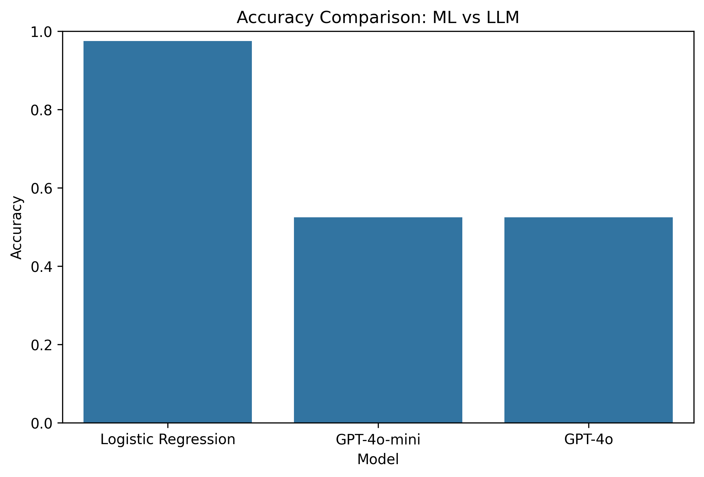
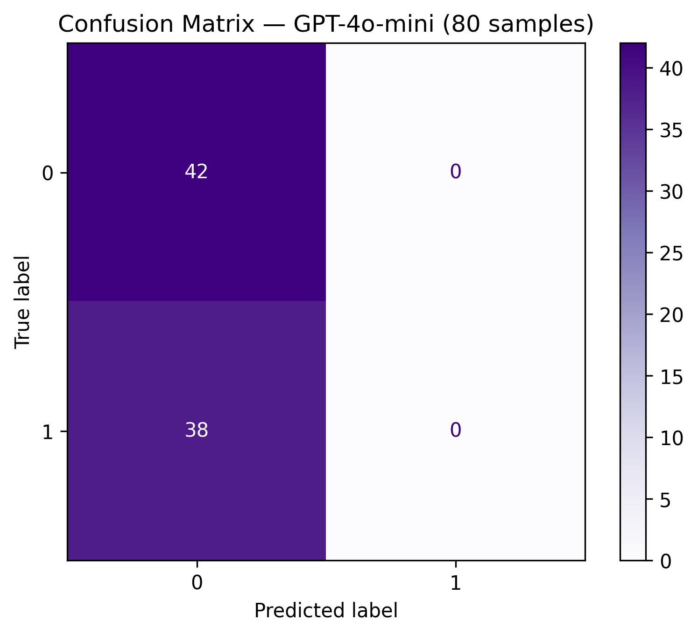

# Fake News Classification — Machine Learning vs Large Language Models

**Author:** Ana Stevanović  
**Year:** 2025  
**Tech:** Python, Scikit-learn, Logistic Regression, TF-IDF, GPT-4o-mini, GPT-4o  
**Goal:** Compare a classical ML pipeline with modern LLM zero-shot classifiers.

---

## Project Overview

This project evaluates two fundamentally different approaches to classifying news articles as **real (0)** or **fake (1)**.

### 1) Machine Learning Baseline

A classical supervised ML pipeline:

- TF-IDF vectorizer
- Logistic Regression classifier
- Trained directly on the dataset

 Achieves around **96% accuracy** on the test set.

### 2) Large Language Models (LLMs)

Zero-shot classification using:

- **GPT-4o-mini**
- **GPT-4o**

LLMs are **not trained** on the dataset — they rely solely on general world knowledge and prompting.  
On a held-out sample of 80 test examples, accuracy is significantly lower than the ML baseline.

---

## Project Structure

```text
project/
── notebooks/
   ── fake_real_news_ml_vs_llm.ipynb
── data/
   ── data.csv              # not included in the repo
── results/
   ── accuracy_comparison.png
   ── confusion_matrix_gpt4o_mini.png
── README.md
── requirements.txt
── .gitignore

 Results

Model	Type	Accuracy
Logistic Regression	Supervised ML	0.9625
GPT-4o-mini	LLM zero-shot	0.65XX
GPT-4o	LLM zero-shot	0.33XX

Classical ML wins easily when trained on a domain-specific dataset.
LLMs struggle when forced to classify fake news without fine-tuning.

Accuracy comparison

Confusion matrix — GPT-4o-mini (sample of 80)

Methodology
1. Data Preparation

Combined headline and body into a single text field

Removed null or malformed entries

Basic EDA:

label distribution

text length histograms

example inspection

2. Machine Learning Pipeline
from sklearn.pipeline import Pipeline
from sklearn.feature_extraction.text import TfidfVectorizer
from sklearn.linear_model import LogisticRegression

ml_model = Pipeline([
    ("tfidf", TfidfVectorizer(
        max_features=50_000,
        stop_words="english",
        min_df=2,
        max_df=0.8
    )),
    ("lr", LogisticRegression(max_iter=200))
])


The model is trained on the training split and evaluated on the held-out test set with accuracy and a full classification report.

3. LLM Evaluation (Zero-shot)

GPT models are prompted with a simple classification instruction:

response = client.chat.completions.create(
    model="gpt-4o-mini",
    messages=[{"role": "user", "content": prompt}],
    max_tokens=1,
)


A sample of 80 test examples is used for evaluation.

Predictions are converted to labels (0 = real, 1 = fake).

Accuracy, classification report and confusion matrix are computed.

## Results (visual)






What I Learned

Supervised ML shines on structured, domain-specific tasks.

Prompting alone cannot replace dataset-specific training.

Zero-shot LLM performance varies significantly by model size.

LLM outputs must be measured, not assumed (bias & hallucinations).

ML interpretability (e.g. top TF-IDF features) is extremely valuable.

How to Run
1. Install dependencies
pip install -r requirements.txt

2. Set OpenAI API key
export OPENAI_API_KEY="your_key_here"  # macOS / Linux


or on Windows (PowerShell):

setx OPENAI_API_KEY "your_key_here"

3. Run the notebook

Open in Jupyter Lab or VS Code:

notebooks/fake_real_news_ml_vs_llm.ipynb


and run all cells.

Contact

For conversation, collaboration or technical discussion:

LinkedIn: https://www.linkedin.com/in/ana-stevanovic